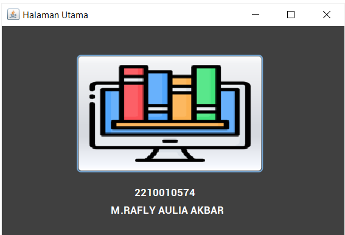
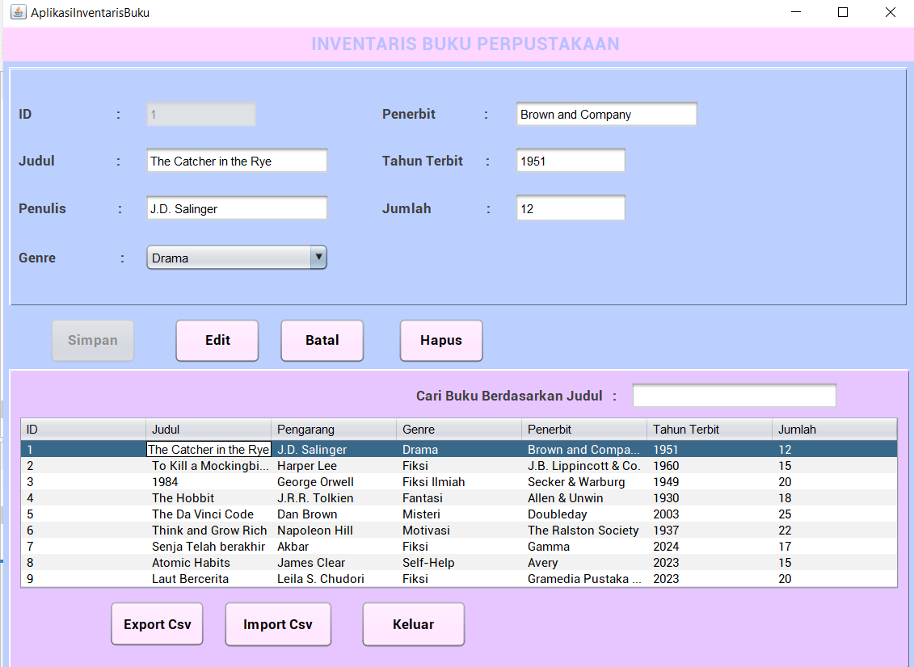
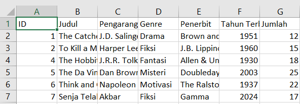
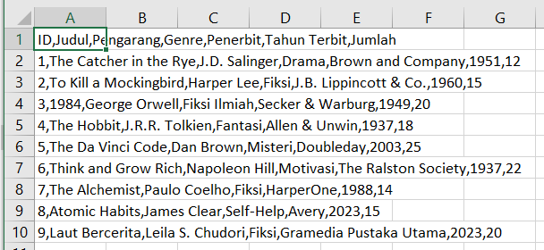

Berikut adalah README file yang telah diperbarui dengan ikon buku pada judul dan tambahan bagian untuk beberapa gambar:

---

# 📚 Aplikasi Inventaris Barang

Aplikasi ini dirancang untuk membantu pengguna dalam mengelola inventaris barang. Dengan fitur pencatatan, pencarian, dan ekspor/impor data, aplikasi ini sangat berguna untuk pengelolaan barang di berbagai keperluan, seperti perpustakaan, toko, atau gudang.

## Fitur Utama

- **Tambah Data Barang:** Input informasi barang seperti ID, nama barang, kategori, jumlah, penerbit, dan tahun.
- **Riwayat Barang:** Menampilkan daftar barang yang telah dicatat dengan detail yang lengkap.
- **Ekspor Data:** Ekspor data inventaris ke format CSV untuk dokumentasi atau analisis lebih lanjut.
- **Impor Data:** Impor data dari file CSV untuk memperbarui tabel inventaris barang.
- **Filter Pencarian:** Cari barang berdasarkan kata kunci tertentu (contoh: berdasarkan nama atau kategori).
- **Hapus Data:** Hapus barang yang sudah tidak relevan dari daftar.

## Teknologi yang Digunakan

- **Bahasa Pemrograman:** Java
- **Antarmuka Pengguna:** Swing
- **Penyimpanan Data:** Database SQLite (dikelola melalui `koneksi`)

## Cara Menggunakan

### Tambah Data Barang
1. Masukkan informasi barang seperti:
   - ID barang
   - Nama barang
   - Kategori barang
   - Jumlah barang
   - Penerbit barang
   - Tahun terbit barang
2. Klik tombol **Simpan** untuk menambahkan data ke database.

### Edit Data Barang
1. Pilih baris yang akan diubah dari tabel.
2. Perbarui informasi di form.
3. Klik tombol **Edit** untuk menyimpan perubahan.

### Hapus Data Barang
1. Pilih baris yang ingin dihapus dari tabel.
2. Klik tombol **Hapus**.

### Ekspor Data ke CSV
1. Klik tombol **Ekspor CSV**.
2. Pilih lokasi penyimpanan file dan simpan file.

### Impor Data dari CSV
1. Klik tombol **Impor CSV**.
2. Pilih file CSV yang ingin diimpor.
3. Data akan ditambahkan ke database.

### Filter Data Barang
1. Masukkan kata kunci di kolom pencarian.
2. Data yang sesuai akan ditampilkan di tabel.

## Struktur File

- **AplikasiInventarisBuku.java:** Halaman utama aplikasi dengan fitur manajemen barang.
- **koneksi.java:** Kelas untuk mengatur koneksi ke database SQLite.
- **Database:** Tabel barang berisi informasi lengkap barang seperti ID, nama, kategori, jumlah, penerbit, dan tahun.

## Screenshot

### Halaman Utama
*(Tambahkan screenshot dari halaman utama aplikasi di sini)*

### Riwayat Barang
*(Tambahkan screenshot dari daftar barang di sini)*

### Ekspor Data
*(Tambahkan screenshot saat melakukan ekspor data di sini)*

### Impor Data
*(Tambahkan screenshot saat melakukan impor data di sini)*

## Penulis

- **Nama:** M. Rafly Aulia Akbar
- **NPM:** 2210010574

## Dukungan Ikon

Ikon dalam aplikasi ini didukung oleh **Icons8**.

---

**Catatan:**
1. Ganti nama file gambar pada bagian screenshot sesuai dengan nama file yang Anda gunakan.
2. Pastikan file gambar diletakkan di folder `screenshots` di dalam direktori proyek Anda.